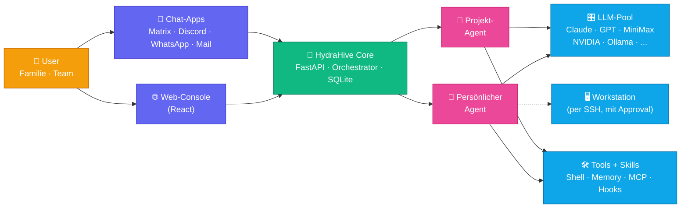

<p align="center">
  
</p>

<h1 align="center">HydraHive</h1>

<p align="center">
  <strong>Ein Stock für deine AI-Agenten.</strong><br/>
  <em>A hive for your AI agents.</em>
</p>

<p align="center">
  <a href="https://hydrahive.org"></a>
  
  
  
  
  
</p>

---

Jeder Mensch bekommt seinen **eigenen persönlichen Agenten**.
Jedes Projekt bekommt seine **gemeinsamen Arbeits-Agenten**.
Alles läuft auf **deiner Hardware**, **24/7** — egal, ob dein Laptop an ist.

> [!TIP]
> **Warum gibt es HydraHive?**
> Aus einer einfachen Frage heraus: *Warum muss mein Rechner laufen, damit die
> Familie einen Assistenten hat?* Inzwischen ist daraus eine Plattform
> geworden, auf der **Familien, Teams oder Einzelne ihr eigenes
> AI-Ökosystem** bauen können — mit dem LLM ihrer Wahl, ohne
> Cloud-Vendor-Lock-in, mit eigenen Tools und eigenen Daten.

> [!WARNING]
> **Das hier ist ein Bastelprojekt, keine Firma.**
> HydraHive ist kein Produkt, keine Enterprise-Plattform, kein SaaS. Es ist ein
> Self-Hosted-AI-Backbone, der für meine Familie entstanden ist und jetzt auch
> für andere offen ist. Der Core ist stabil und läuft hier seit Monaten 24/7,
> aber Features wachsen schnell, Breaking-Changes passieren, Support ist
> Community-basiert (keine SLAs), Doku ist primär Deutsch und Englisch. Wer
> damit arbeiten will: herzlich willkommen. Wer etwas Enterprise-fertiges
> sucht: falsche Adresse — noch.

---

## 🎁 Was drin ist

### 🤖 Deine Agenten, deine Regeln
Persönlicher Agent pro User · Projekt-Agenten für Teams · Rollen, Permissions, Audit-Log · Composer für Agent-Prompts · eigenes Gedächtnis pro Agent

### 🧠 Jedes LLM
Anthropic · OpenAI · **Claude Max OAuth** · MiniMax · **NVIDIA NIM** · DeepSeek · Google · Ollama (lokal auf Server oder Workstation) · Fallback-Ketten

### 🛠️ Alles an Tools
Shell · Dateien lesen/schreiben · Web-Search (SearXNG, kein Tracking) · Gedächtnis · Agent-zu-Agent-Calls · **MCP-Server** anbinden · **Skills** installieren · **Hooks** definieren · Sub-Agent-Worktrees · Permission-Layers · WKS-SSH

### 💬 Da, wo du bist
Web-Console (React) · Matrix · Discord · WhatsApp · Mail · Voice-Input · Token-Streaming mit Stop-Button

### 🖥️ Auf deiner Workstation
Dein persönlicher Agent kann via SSH auf deinem Rechner arbeiten (mit Approval) · Workstation-eigenes Ollama einbinden · Samba-Share · individueller SSH-Port

### 🏠 Zuhause, nicht in der Cloud
Läuft auf deiner Hardware (Homelab · NAS · Proxmox-VM) · **One-Click-Installer** · Self-hosted, self-owned · Updates per Konsole · SSH Host-Key-Pinning für Target-Systeme

---

## 🏗️ Architektur



---

## 🚀 Quick Start

```bash
git clone https://github.com/hydrahive/hydrahive.git
cd hydrahive
sudo bash installer/install.sh
# → open https://<IP> → Setup-Wizard
```

### Deployment-Profile

| Profil | GPU | LLM | Gut für |
|---|---|---|---|
| 🪶 **Lite** | nein | Cloud-APIs | VPS · Demo · Testing |
| 🦾 **Full** | ja (PCIe-Passthrough) | Ollama + Cloud | Produktion · volle Kontrolle |

> Referenz-Setup: **GTX 1080 Ti** (11 GB VRAM) auf Proxmox-VM, Ubuntu 24.04. Läuft aber auch auf kleineren Setups.

---

## 📚 Dokumentation

| Dokument | Inhalt |
|---|---|
| 📖 [Handbook](docs/handbook.md) | Installation, Getting started, alle Features |
| 🔧 [Technical Docs](docs/technical.md) | Architektur, Module, Data-Flow |
| 🔌 [API Reference](docs/api-reference.md) | Alle REST-Endpoints |
| 🛠️ [Developer Guide](docs/development.md) | Tools, Skills, Endpoints, Console-Pages hinzufügen |
| 👥 [Enduser-Handbuch](docs/enduser-handbuch.md) | Für die Familie/das Team (DE) |

---

## 🧱 Stack

**Core:** Python 3.12 · FastAPI · LiteLLM · matrix-nio · Anthropic SDK
**Console:** React 18 · TypeScript · Vite · Tailwind CSS
**Matrix:** conduwuit (Rust, single binary, RocksDB)
**Search:** SearXNG (nativ, kein Docker)
**Installer:** Bash + systemd (kein Docker)

---

## 🐉 中文简介

**为家庭和团队构建的自托管 AI 智能体平台。**

每个人都有自己的个人智能体，每个项目都有共享的协作智能体。全部运行在你自己的硬件上，
24/7 在线 — 不需要你的笔记本一直开着。

### ✨ 核心功能

- 🤖 **个人智能体 + 项目智能体** — 多用户、角色权限、审计日志
- 🧠 **任意大语言模型（LLM）** — Anthropic · OpenAI · Claude Max OAuth · MiniMax · NVIDIA NIM · DeepSeek · Google · Ollama（本地）
- 🛠️ **丰富的工具与技能** — Shell · 文件 · Web 搜索 · 记忆系统 · MCP 服务器 · Skills · Hooks
- 💬 **多平台接入** — Web 控制台 · Matrix · Discord · WhatsApp · Mail · 语音输入
- 🖥️ **工作站集成** — 智能体可通过 SSH 在你的电脑上工作（需审批）
- 🏠 **完全自托管** — 运行在你的硬件上（Homelab · NAS · Proxmox）· 一键安装 · 数据归自己

### 🚀 快速开始

```bash
git clone https://github.com/hydrahive/hydrahive.git
cd hydrahive
sudo bash installer/install.sh
# → 打开 https://<IP> → 进入安装向导
```

### 📚 文档

目前文档主要以**英语和德语**为主，见上方 [Documentation](#-dokumentation) 章节。

### ⚠️ 诚实声明

> [!WARNING]
> **这是一个业余项目，不是商业产品。**
> HydraHive 最初是为了让家人有一个 24/7 在线的 AI 助手而构建的，目前开放给所有想自托管 AI 系统的人使用。核心功能稳定，但新功能迭代很快，接口可能会变动。
>
> **主要支持语言为德语和英语** — 中文 Issue 和 PR 非常欢迎，但维护者不是母语者，响应以英德为主。寻找企业级支持的用户请另寻他处。

---

## 🚧 Status

**Active development · Hobby project.**
Stable Core, Features wachsen schnell, Breaking-Changes passieren — im
[Changelog](docs/changelog.md) markiert. Kein kommerzieller Support, kein SLA.
Issues und PRs willkommen auf Deutsch oder Englisch.

---

## 🪪 License

[MIT](LICENSE)

<p align="center">
  <a href="https://hydrahive.org">🐝 hydrahive.org</a>
</p>
