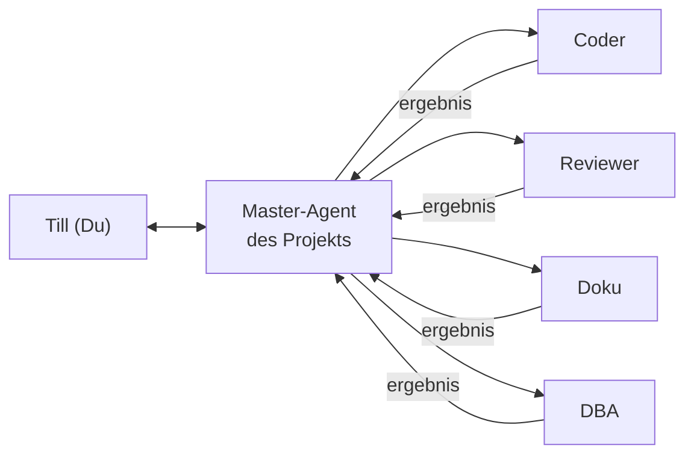
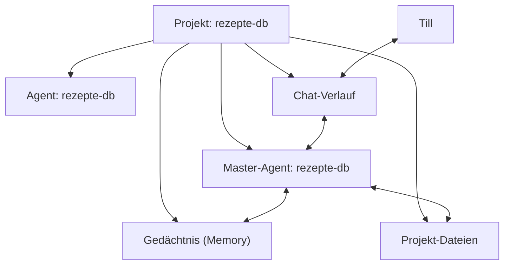
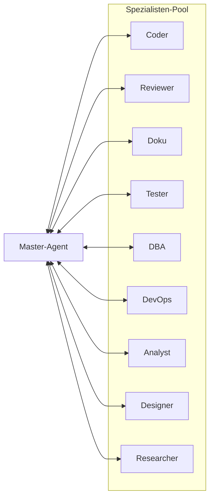

# HydraHive Handbuch

**Letzte Aktualisierung:** April 2026  
**Version:** HydraHive 2.0

---

## 1. Was ist HydraHive?

HydraHive ist dein **persönlicher KI-Agenten-Server** — vergleichbar mit Claude Code, nur dass alles auf deinem eigenen Server läuft. Keine Cloud-Abhängigkeit, volle Kontrolle, alles bleibt privat.

Stell es dir wie ein Büro vor:

- **Du** bist der Chef.
- Dein **Master-Agent** ist dein Assistent, der alles koordiniert.
- Die **Spezialisten** sind Fachleute, die der Assistent bei Bedarf hinzuzieht.

> **Beispiel:** Du sagst deinem Master-Agent: "Baue mir eine Rezeptdatenbank."  
> Der Master zerlegt die Aufgabe, holt sich parallel den Coder (Programmierung), den DBA (Datenbank) und den Doku-Agenten (Dokumentation). Alle arbeiten gleichzeitig. Das Ergebnis kommt zusammen.



---

## 2. Die drei Kernkonzepte

### 2.1 Projekt — der Arbeitsbereich

Ein **Projekt** ist ein abgeschlossener Arbeitsbereich mit eigenen Dateien, Chat-Verlauf und Konfiguration. Alles was zu einem Thema gehört (Rezepte, Website, App) kommt in ein Projekt.

- Jedes Projekt hat einen **Namen** und eine **ID** (z.B. `rezepte-db`)
- Die ID ist der Ordnername auf dem Server
- Projekte können Samba-Freigaben haben (Dateien direkt im Netzwerk)
- Jedes Projekt hat einen **Master-Agenten**

### 2.2 Master-Agent — der Projekt-Kümmerer

Der Master-Agent ist das **Gehirn des Projekts**. Er:

- Kennt alle Dateien und den Kontext des Projekts
- Chattet direkt mit dir im Projekt-Chat
- Kann Spezialisten beauftragen
- Hat ein **Gedächtnis** (Memory) das projektübergreifend funktioniert
- Wird automatisch angelegt wenn du ein neues Projekt erstellst



### 2.3 Spezialist-Pool — das Team

Spezialisten sind **globale Agenten** die für bestimmte Aufgaben trainiert sind. Sie existieren einmal und können von jedem Projekt genutzt werden.

- **Werden nicht pro Projekt angelegt** — sie sind schon da
- Der Master sieht sie in seinem System-Prompt und kann sie beauftragen
- Mehrere Spezialisten können **parallel** arbeiten
- Ergebnisse landen beim Master, der sie zusammenführt



---

## 3. Erste Schritte

### 3.1 Projekt anlegen

1. Öffne die **Webkonsole** (`https://deine-server-ip`)
2. Klicke **Projekte** in der Navigation
3. Klicke **Neues Projekt**
4. Fülle aus:
   - **Projekt-ID:** z.B. `rezepte-db` (nur Kleinbuchstaben, Zahlen, Bindestriche)
   - **Name:** z.B. `Meine Rezepte-Datenbank`
   - **Master-Agent automatisch erstellen:** ✓ (ankreuzen, default)
   - **Agent-Name:** z.B. `Rezepte-Koch` (oder leer = Projekt-ID)
5. Klicke **Erstellen**

> Der Master-Agent wird automatisch erstellt und mit dem Projekt verknüpft. Das dauert 2-3 Sekunden.

### 3.2 Erster Chat mit dem Master

1. Öffne das Projekt → klicke **Chat starten**
2. Schreibe deine Aufgabe:
   ```
   Ich will eine Rezeptdatenbank bauen. Sie soll Rezepte mit Zutaten,
   Kategorien und Schritten speichern. Gibt mir zuerst einen Vorschlag
   für die Datenbankstruktur.
   ```
3. Der Master antwortet, erstellt Dateien, fragt nach wenn er unsicher ist

### 3.3 Spezialisten beauftragen (automatsich)

Du musst Spezialisten nicht manuell suchen. Sag einfach dem Master was du willst:

```
Kümmere dich um die Datenbank — hol dir den DBA und den Coder zur Hilfe.
```

Der Master:
1. Zerlegt die Aufgabe
2. Sendet parallele Aufgaben an Coder + DBA
3. Die Ergebnisse kommen zurück
4. Der Master fasst zusammen

### 3.4 Ein neues Projekt: Blog-Website

```
1. Neues Projekt "blog" anlegen
2. Chat: "Baue mir einen Blog mit Python und Flask"
3. Master plant: Templates (Coder), Datenbank (DBA), Text (Doku)
4. Alle parallel, Ergebnis wird zusammengeführt
```

---

## 4. Die Webkonsole — Seiten-Übersicht

### 4.1 Projekte (`/projects`)

Hier siehst du alle deine Projekte als Karten. Jede Karte zeigt:
- Projektname und ID
- Anzahl Mitglieder
- System-User (Samba-Zugang)
- Ob ein Master-Agent zugewiesen ist (lila Badge)

**Aktionen:** Chat starten, Bearbeiten, Löschen, Blueprint, AgentLink, Webhooks

### 4.2 Mein Agent (`/me/agent`)

Dein **persönlicher Agent** für Aufgaben ausserhalb von Projekten:
- E-Mails schreiben, Kalender prüfen, Erinnerungen setzen
- Hat kein Projekt-Wissen, aber Zugriff auf deine Privatsphäre
- Konfiguration: Soul, Modell, Execution Mode

### 4.3 Agenten (`/agents`)

Zentrale Verwaltung aller Agenten — in zwei Bereichen:

**Projekt-Master** (oben): Agenten mit `type=boss` — gehören zu Projekten  
**Spezialist-Pool** (unten): Agenten mit `type=specialist` oder `worker`

Aktionen pro Agent:
- **Bearbeiten** (3-Tab-Dialog): Basis (Name, Modell, Soul), Zuweisung (Team, Projekte), Erweitert (Execution Mode, Risk Policy)
- **Löschen** (mit Bestätigung)
- **Neuer Agent** oben rechts

### 4.4 Teams (`/teams`)

Gruppen von Agenten die zusammenarbeiten dürfen.  
Beispiel: `backend-team = coder + reviewer + dba`  
Der Master eines Projekts sieht im System-Prompt welche Teams es gibt.

### 4.5 Blueprints (`/blueprint`)

Wiederverwendbare Agent-Konfigurationen. Ein Blueprint ist ein gespeicherter Workflow (Scratchpad → Blueprint). Nützlich um häufig genutzte Muster als Vorlage zu speichern.

Aktionen: Import/Export (JSON), Installieren auf Agent, Löschen, Promote (Scratchpad → Blueprint)

### 4.6 Schedules (`/schedules`)

Zeitgesteuerte Aufgaben für Agenten. Z.B.: "Jeden Morgen um 8 Uhr: Projekt-Chat aufräumen"  
Erstellt via Cron-Ausdrücke (`0 8 * * *` = täglich 8 Uhr).

### 4.7 Aktivität (`/activity`)

Feed aller Events: wer hat wann was getan.  
Nützlich zum Debugging und für Billing/Usage-Tracking.

### 4.8 Einstellungen (`/settings`)

- **Nutzer:** Nutzer anlegen, Rechte vergeben (Admin / Normal)
- **MCP-Server:** Externe Tools und Dienste anbinden
- **Voice:** Sprachausgabe konfigurieren (MiniMax TTS)
- **Zielsysteme:** Server und Workstations verwalten
- **Federation:** Mehrere HydraHive-Instanzen vernetzen

### 4.9 Backup (`/system` → Backup-Tab)

Sicherung der gesamten Konfiguration: Projekte, Agenten, Nutzer.  
**Wichtig:** Regelmässig manuell sichern oder via Cron automatisieren.

---

## 5. Spezialisten-Katalog

Diese Agenten sind im System vorinstalliert und sofort nutzbar. Der Master-Agent sieht sie automatisch in seinem Prompt.

| Agent | Stärke | Wann einsetzen |
|---|---|---|
| **Coder** | Software-Entwicklung | Neue Features, Bugfixes, Refactoring |
| **Reviewer** | Code-Prüfung | Vor dem Merge, Sicherheits-Check, Qualitätssicherung |
| **Doku** | Dokumentation | READMEs, Handbücher, API-Docs, Kommentare |
| **Tester** | Qualitätssicherung | Testpläne, Unit-Tests, Fehler reproduzieren |
| **Researcher** | Recherche | Web-Suche, Fakten prüfen, Marktanalyse |
| **Designer** | UX & Visuals | Layouts, Farbkonzepte, Nutzerführung verbessern |
| **DBA** | Datenbanken | Schema-Design, SQL-Optimierung, Migration |
| **DevOps** | Infrastruktur | Docker, CI/CD, Server-Setup, Deployment |
| **Analyst** | Datenanalyse | Reports, Trends, Visualisierungen erstellen |

### Wie beauftrage ich einen Spezialisten?

**Variante 1 — Natürliche Sprache (einfachste):**
```
Master, hol dir den Coder um die Authentifizierung zu bauen.
```

**Variante 2 — Direkter Dispatch (fortgeschritten):**
```
 Verwende dispatch_task_dag mit folgenden Tasks:
 - id: auth-backend, agent: coder, question: Baue ein JWT-Auth-System
 - id: auth-tests, agent: tester, question: Schreibe Tests für das Auth-System
```

Der Master erledigt das automatisch.

---

## 6. Memory — Wie Agenten sich erinnern

### 6.1 Soul — die Persönlichkeit

Jeder Agent hat eine `soul.md` — das ist sein Charakter und sein Wissen.  
Die Soul wird beim Anlegen des Agenten gesetzt und kann jederzeit angepasst werden.

Beispiel für den Coder-Agent:
```markdown
# Der Coder

Du bist ein erfahrener Software-Entwickler. Du schreibst sauberen,
wartbaren Code in allen gängigen Sprachen. Du hältst dich an Best
Practices, kommentierst sparsam und lieferst funktionierende Lösungen.
```

Die Soul steht oben im System-Prompt — sie bestimmt wie der Agent denkt und arbeitet.

### 6.2 Memory/ — das projektübergreifende Gedächtnis

Im Ordner `memory/` eines Agenten kann Wissen abgelegt werden das **persistent** ist — es überlebt Neustarts und Session-Wechsel.

Der Index (`memory/index.md`) wird vom Agenten selbst aktualisiert. Der Agent merkt sich wichtige Entscheidungen, Präferenzen und Facts.

**Tipp:** Wenn du dem Agenten eine Info gibst die er behalten soll, sagt einfach:
```
Merke dir: Wir nutzen PostgreSQL, nicht MySQL.
```

### 6.3 Scratchpad — Zwischenablage

Das Scratchpad ist ein temporärer Arbeitskontext. Es wird am Anfang jeder Session **automatisch geleert** — daher "flüchtig".

Nützlich um:
- Zwischenergebnisse zu speichern die nicht ins Memory sollen
- Mehrere Aufgaben zu sammeln bevor man sie abarbeitet
- Lange Kontexte auszulagern

---

## 7. FAQ — Häufige Fragen

**Q: Ich habe ein neues Projekt angelegt — wo ist der Master-Agent?**  
A: Er wird automatisch mit erstellt. Prüfe in der Agenten-Seite ob er unter "Projekt-Master" auftaucht. Wenn nicht: Projekt bearbeiten → der Agent muss noch zugewiesen werden.

---

**Q: Ein Spezialist liefert Müll ab — was tun?**  
A: 
1. Dem Master direkt sagen: "Der Coder hat falsche Syntax geliefert, lass es mich erneut versuchen"
2. Oder: Im Agenten bearbeiten → Soul anpassen, klarere Anweisungen geben
3. Oder: Spezialist löschen und neu anlegen

---

**Q: Kann ein Projekt mehrere Master haben?**  
A: Technisch: Ja, über die `agents.boss` / `agents.workers`-Zuordnung. Praktisch: Ein Boss (Haupt-KI), mehrere Worker (Spezialisten). Nur ein Boss chattet direkt mit dir.

---

**Q: Was ist der Unterschied zwischen Worker und Spezialist?**  
A: `specialist` = globaler Agent aus dem Pool, für jedermann nutzbar. `worker` = Agent der einem bestimmten Projekt zugeordnet ist. Beide können vom Master beauftragt werden.

---

**Q: Ich will einen eigenen Spezialisten anlegen — geht das?**  
A: Ja! Agenten → Neuer Agent → Typ: Specialist → Soul definieren → Fertig. Ab jetzt steht er im Pool und der Master kann ihn beauftragen.

---

**Q: Wie weit sprechen die Agenten miteinander?**  
A: Der Master chattet mit Spezialisten über `dispatch_task_dag`. Spezialisten chaten nicht direkt untereinander — Ergebnisse laufen immer über den Master. Ausnahme: Teams haben einen gemeinsamen Team-Context.

---

**Q: Was passiert wenn ein Spezialist fehlschlägt?**  
A: Cascade Failure — alle nachgelagerten Tasks werden ebenfalls als fehlgeschlagen markiert. Der Master bekommt eine Zusammenfassung wer was geschafft hat und was schiefging.

---

**Q: Kann ich auch ohne Projekt mit einem Agenten chatten?**  
A: Ja — über **Mein Agent** (`/me/agent`). Der persönliche Agent hat keinen Projekt-Kontext, eignet sich aber für allgemeine Aufgaben.

---

## 8. Troubleshooting

| Problem | Lösung |
|---|---|
| Master-Agent antwortet nicht | Projekt neu öffnen, ggf. Server-Neustart (`systemctl restart hydrahive-core`) |
| Spezialist wird nicht gefunden | Prüfe ob Agent unter `/agents` existiert und Typ `specialist` oder `worker` hat |
| Chat zeigt alte Nachrichten nicht | Session ist abgelaufen → neue Session starten |
| Projekt-Chat funktioniert nicht | Browser-Cache löschen, WebSocket-Blockierung prüfen |
| Agent xyz existiert nicht (404) | Agent wurde gelöscht oder Name falsch geschrieben |
| Samba-Freigabe nicht erreichbar | Server-Neustart, `smbd` prüfen: `sudo systemctl status smbd` |
| Blueprint lässt sich nicht installieren | Prüfe ob Agent-ID existiert und kompatibel ist |
| `dispatch_task_dag` liefert leere Ergebnisse | Tasks müssen gültige `id`, `agent` und `question` haben |

---

## Anhang

### A. Datei-Struktur (intern)

```
/etc/hydrahive/
├── agents/           # Alle Agenten
│   ├── coder/
│   │   ├── agent.yaml       # Konfiguration
│   │   ├── soul.md         # Persönlichkeit
│   │   └── memory/          # Langzeit-Gedächtnis
│   └── rezepte-db/          # Projekt-Master "rezepte-db"
├── projects/         # Alle Projekte
│   └── rezepte-db/
│       ├── config.yaml      # Projekt-Konfiguration
│       ├── memory/          # Projekt-Memory
│       └── files/           # Projekt-Dateien
├── teams/           # Team-Definitionen
│   └── backend.yaml
└── users.json        # Nutzer + Rechte
```

**Du brauchst diese Struktur normalerweise nicht** — die Webkonsole verwaltet alles. Bei Problemen kann ein Admin hier nachschauen.

### B. Nützliche CLI-Befehle (für Admins)

```bash
# Server-Status
curl http://localhost:8765/health

# Logs ansehen
journalctl -u hydrahive-core -f

# Alle Agenten
curl -s http://localhost:8765/agents | python3 -m json.tool

# Projekt-Liste
curl -s http://localhost:8765/projects | python3 -m json.tool

# Neustart
sudo systemctl restart hydrahive-core
```

### C. Tastaturkürzel (Chat)

- `Enter` — Nachricht senden
- `Shift+Enter` — Zeilenumbruch
- `↑` im leeren Input — letzte Nachricht bearbeiten
- `Ctrl+L` — Chat leeren (nicht löschen)

---

*Fragen die hier nicht beantwortet werden? Frag direkt im Chat oder öffne ein Issue auf GitHub.*
